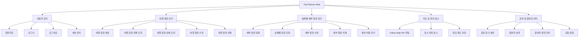
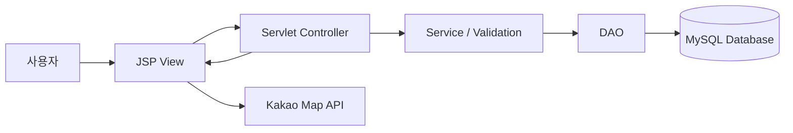
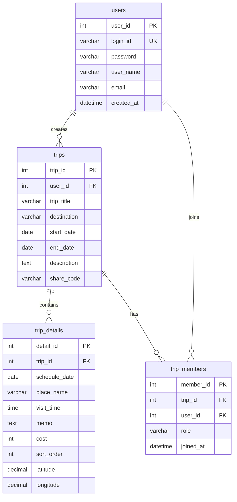
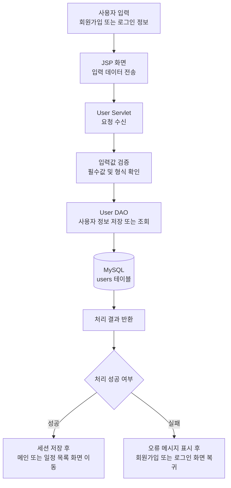
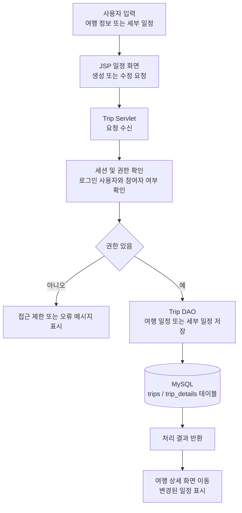

# Project Architecture and Schedule

## 여행 일정 공유 웹 서비스 (Trip Planner Web)

본 문서는 1주차 요구사항 분석 및 설계 문서를 바탕으로 프로젝트의 기능 구조, 시스템 구조, 역할 분담, 구현 일정을 구체화한 문서이다.
프로젝트는 JSP / Servlet / JDBC 기반 MVC(Model2) 구조로 구현하며, 사용자 관리, 여행 일정 관리, 날짜별 세부 일정 관리, 지도 표시, 공유 및 참여자 관리 기능을 중심으로 개발한다.

---

## 1. 프로젝트 구조 설계

### 1.1 기능 구조

Trip Planner Web은 사용자가 여행 일정을 생성하고, 날짜별 세부 계획을 등록하며, 참여자와 함께 일정을 공유 및 수정할 수 있는 웹 서비스이다.



### 1.2 시스템 구조

본 프로젝트는 MVC(Model2) 패턴을 적용하여 화면 출력, 요청 처리, 데이터 처리를 분리한다. 이를 통해 기능별 책임 범위를 명확히 하고, 유지보수와 기능 확장을 쉽게 한다.




| 계층         | 구성 요소                  | 주요 역할                                                         |
| -------------- | ---------------------------- | ------------------------------------------------------------------- |
| View         | JSP, Bootstrap, JavaScript | 화면 출력, 입력 폼, 목록/상세 화면 구성, 지도 표시                |
| Controller   | Servlet                    | 요청 URL 처리, 입력값 검증, 세션 확인, Model 호출, 화면 이동 제어 |
| Model        | DTO, DAO                   | 데이터 객체 관리, JDBC 기반 CRUD 처리                             |
| Database     | MySQL                      | 사용자, 여행 일정, 세부 일정, 참여자 데이터 저장                  |
| External API | Kakao Map API              | 장소 위치 표시, 지도 기반 일정 확인                               |

### 1.3 디렉터리 구조

본 프로젝트는 Maven 기반 Java 웹 프로젝트 구조를 사용한다. Java 소스 코드는 `src/main/java`에 기능별 패키지로 분리하고, JSP 화면과 정적 리소스는 `src/main/webapp` 아래에 배치한다.

```text
TripPlannerWeb/
├── pom.xml
├── src/
│   └── main/
│       ├── java/
│       │   └── com/
│       │       └── tripplanner/
│       │           ├── controller/
│       │           │   ├── UserServlet.java
│       │           │   ├── TripServlet.java
│       │           │   ├── TripDetailServlet.java
│       │           │   └── MemberServlet.java
│       │           ├── dao/
│       │           │   ├── UserDAO.java
│       │           │   ├── TripDAO.java
│       │           │   ├── TripDetailDAO.java
│       │           │   └── TripMemberDAO.java
│       │           ├── dto/
│       │           │   ├── UserDTO.java
│       │           │   ├── TripDTO.java
│       │           │   ├── TripDetailDTO.java
│       │           │   └── TripMemberDTO.java
│       │           └── util/
│       │               ├── DBUtil.java
│       │               └── PasswordUtil.java
│       ├── resources/
│       │   └── db.properties
│       └── webapp/
│           ├── index.jsp
│           ├── WEB-INF/
│           │   └── web.xml
│           ├── views/
│           │   ├── common/
│           │   │   ├── header.jsp
│           │   │   └── footer.jsp
│           │   ├── user/
│           │   │   ├── login.jsp
│           │   │   └── register.jsp
│           │   ├── trip/
│           │   │   ├── list.jsp
│           │   │   ├── form.jsp
│           │   │   └── detail.jsp
│           │   └── member/
│           │       └── manage.jsp
│           └── assets/
│               ├── css/
│               │   └── style.css
│               ├── js/
│               │   ├── map.js
│               │   └── trip.js
│               └── images/
└── README.md
```

| 디렉터리/파일 | 역할 |
| --- | --- |
| `pom.xml` | Maven 의존성, 빌드 설정, Java/Tomcat 관련 설정 관리 |
| `src/main/java/.../controller` | Servlet 클래스 배치, 사용자 요청 처리 및 화면 이동 제어 |
| `src/main/java/.../dao` | MySQL과 연동하는 JDBC 기반 데이터 접근 로직 관리 |
| `src/main/java/.../dto` | 사용자, 여행 일정, 세부 일정, 참여자 데이터를 전달하는 객체 관리 |
| `src/main/java/.../util` | DB 연결, 비밀번호 처리 등 공통 유틸리티 관리 |
| `src/main/resources` | DB 접속 정보 등 설정 파일 관리 |
| `src/main/webapp` | 웹 루트 디렉터리, JSP와 정적 리소스 배치 |
| `src/main/webapp/WEB-INF` | 직접 접근을 막아야 하는 웹 설정 파일 관리 |
| `src/main/webapp/views` | 기능별 JSP 화면 관리 |
| `src/main/webapp/assets` | CSS, JavaScript, 이미지 파일 관리 |

### 1.4 주요 화면 구조

1주차 화면 설계 문서의 와이어프레임을 기준으로 다음 화면을 구현한다.


| 화면                     | 주요 기능                                         | 연결 요구사항                   |
| -------------------------- | --------------------------------------------------- | --------------------------------- |
| 메인 화면                | 서비스 소개, 로그인/회원가입 이동, 일정 목록 이동 | 사용자 접근성                   |
| 회원가입 화면            | 아이디, 비밀번호, 이름, 이메일 입력               | 회원가입                        |
| 로그인 화면              | 아이디와 비밀번호 인증                            | 로그인, 세션 관리               |
| 여행 일정 목록 화면      | 내가 생성하거나 참여 중인 여행 일정 조회          | 여행 일정 조회                  |
| 여행 일정 생성/수정 화면 | 제목, 목적지, 기간, 설명 입력                     | 여행 일정 생성/수정             |
| 여행 일정 상세 화면      | 날짜별 일정, 지도, 참여자, 공유 링크 표시         | 세부 일정 조회, 위치 표시, 공유 |
| 세부 일정 등록/수정 화면 | 날짜, 장소, 시간, 메모, 비용, 위치 입력           | 세부 일정 등록/수정             |
| 참여자 관리 화면         | 참여자 목록, 초대, 권한 표시                      | 참여자 초대, 공동 편집          |

### 1.5 화면 설계 자료

#### 메인 화면


#### 여행 일정 목록 화면


#### 여행 일정 상세 화면


### 1.6 데이터베이스 구조

요구사항 분석 문서의 DB 설계 요소를 기반으로 사용자, 여행 일정, 세부 일정, 참여자 테이블을 구성한다.



### 1.7 기능별 처리 흐름

#### 회원가입 및 로그인



#### 여행 일정 생성 및 세부 일정 등록



---

## 2. 역할 분담

### 2.1 팀원별 담당 업무


| 이름   | 학번     | 주요 역할               | 담당 업무                                                                                                           | 책임 범위                                                   |
| -------- | ---------- | ------------------------- | --------------------------------------------------------------------------------------------------------------------- | ------------------------------------------------------------- |
| 김용민 | 20210564 | 팀장 / 백엔드 / DB 설계 | 프로젝트 일정 관리, Servlet/DAO/DTO 구현, MySQL 테이블 설계, 로그인/회원가입, 여행 일정 CRUD, 참여자/공유 기능 구현 | 서버 요청 처리, 데이터 무결성, DB 연동, GitHub 관리         |
| 김준섭 | 20210539 | 프론트엔드 / UI 설계    | JSP 화면 구현, Bootstrap 기반 UI 구성, 화면 흐름 설계, 여행 목록/상세/등록 화면 제작, Kakao Map API 화면 연동       | 사용자 화면 완성도, 입력 폼 검증 보조, 지도 표시, 문서 정리 |

### 2.2 기능별 책임 분담


| 기능 영역             | 담당자         | 협업 방식                                                                 |
| ----------------------- | ---------------- | --------------------------------------------------------------------------- |
| 회원가입/로그인       | 김용민         | 김준섭이 JSP 입력 화면을 구성하고, 김용민이 Servlet/DAO 인증 로직을 연결  |
| 여행 일정 CRUD        | 김용민         | 김준섭이 목록/상세/등록 화면을 제작한 뒤, 김용민이 DB 처리 로직과 연동    |
| 날짜별 세부 일정      | 김용민, 김준섭 | DB 구조와 요청 처리는 김용민, 날짜별 UI와 입력 흐름은 김준섭 담당         |
| 지도 표시             | 김준섭         | 김용민이 DB에 위도/경도 필드를 제공하고, 김준섭이 Kakao Map API 표시 구현 |
| 공유 링크/참여자 관리 | 김용민         | 김준섭이 참여자 관리 화면을 보조 구현                                     |
| 테스트 및 문서화      | 김용민, 김준섭 | 기능별 구현 후 상호 테스트, README와 발표 자료 공동 정리                  |

### 2.3 협업 및 의사소통 방안


| 구분        | 운영 방식                                                                                        |
| ------------- | -------------------------------------------------------------------------------------------------- |
| 버전 관리   | GitHub 저장소를 기준으로 기능 단위 커밋을 작성한다.                                              |
| 브랜치 관리 | 주요 기능 구현 시`feature/login`, `feature/trip`, `feature/map`과 같이 기능별 브랜치를 사용한다. |
| 작업 공유   | 수업 시간 및 온라인 메신저를 통해 진행 상황과 이슈를 공유한다.                                   |
| 코드 통합   | 기능 구현 후 팀장이 충돌 여부를 확인하고 main 브랜치에 병합한다.                                 |
| 문서 관리   | 각 주차별 폴더의 README.md에 산출물을 정리하고, 변경 사항은 GitHub에 반영한다.                   |
| 중간 점검   | 주차별 마일스톤 종료 시 구현 기능, 오류, 미완료 항목을 확인한다.                                 |

---

## 3. 일정 관리 계획

실제 구현 기간은 약 3주로 계획한다. 1주차에는 요구사항과 설계를 확정하고, 2~3주차에는 핵심 기능 구현 및 통합 테스트를 진행한다.

### 3.1 주차별 일정표


| 주차  | 기간                      | 주요 목표                            | 세부 작업                                                                                                          | 산출물                                                    |
| ------- | --------------------------- | -------------------------------------- | -------------------------------------------------------------------------------------------------------------------- | ----------------------------------------------------------- |
| 1주차 | 프로젝트 시작 ~ 설계 완료 | 요구사항 분석 및 기본 설계           | 프로젝트 주제 선정, 기능 요구사항 정리, 비기능 요구사항 정리, 화면 설계, DB 설계 초안 작성                         | 요구사항 분석 README, 화면 와이어프레임                   |
| 2주차 | 구현 1단계                | 프로젝트 구조 구축 및 기본 기능 구현 | JSP/Servlet 프로젝트 생성, DB 연결 설정, users/trips 테이블 생성, 회원가입/로그인, 여행 일정 생성/조회 구현        | 기본 MVC 구조, 사용자 관리 기능, 여행 일정 목록/등록 화면 |
| 3주차 | 구현 2단계                | 세부 일정, 지도, 공유 기능 구현      | trip_details/trip_members 테이블 구현, 날짜별 세부 일정 CRUD, Kakao Map API 연동, 공유 링크, 참여자 초대 기능 구현 | 여행 상세 화면, 날짜별 일정 관리, 지도 표시, 공유 기능    |
| 4주차 | 통합 및 최종 정리         | 테스트, 오류 수정, 발표 문서 정리    | 기능 통합 테스트, 권한 확인, UI 정리, DB 데이터 검증, README 및 발표 자료 보완                                     | 최종 구현 결과, 테스트 문서, 발표 자료                    |

### 3.2 세부 구현 일정


| 단계 | 작업 내용                          | 담당자         | 예상 소요 | 완료 기준                                       |
| ------ | ------------------------------------ | ---------------- | ----------- | ------------------------------------------------- |
| 1    | 프로젝트 기본 구조 생성            | 김용민         | 0.5일     | JSP/Servlet 실행 환경 구성 완료                 |
| 2    | DB 스키마 작성 및 JDBC 연결        | 김용민         | 1일       | MySQL 연결 및 기본 CRUD 테스트 완료             |
| 3    | 공통 레이아웃 및 Bootstrap UI 구성 | 김준섭         | 1일       | 헤더, 네비게이션, 기본 화면 스타일 완료         |
| 4    | 회원가입/로그인 기능 구현          | 김용민, 김준섭 | 1.5일     | 회원가입, 로그인, 로그아웃, 세션 처리 완료      |
| 5    | 여행 일정 CRUD 구현                | 김용민, 김준섭 | 2일       | 일정 생성, 목록, 상세, 수정, 삭제 동작          |
| 6    | 날짜별 세부 일정 CRUD 구현         | 김용민, 김준섭 | 2일       | 날짜별 장소, 시간, 메모, 비용 등록 및 수정 가능 |
| 7    | Kakao Map API 연동                 | 김준섭         | 1.5일     | 상세 화면에서 장소 위치 지도 표시               |
| 8    | 공유 링크 및 참여자 관리 구현      | 김용민         | 1.5일     | 공유 코드 생성, 참여자 추가, 권한 확인          |
| 9    | 통합 테스트 및 오류 수정           | 김용민, 김준섭 | 2일       | 주요 사용자 흐름 테스트 통과                    |
| 10   | 문서 및 발표 자료 정리             | 김용민, 김준섭 | 1일       | README, 테스트 결과, 발표 자료 정리             |

### 3.3 마일스톤


| 마일스톤           | 목표 시점  | 점검 내용                                  | 성공 기준                                                  |
| -------------------- | ------------ | -------------------------------------------- | ------------------------------------------------------------ |
| M1. 설계 확정      | 1주차 종료 | 요구사항, 화면, DB 설계 확인               | 주요 기능 범위와 DB 테이블 확정                            |
| M2. 기본 기능 완성 | 2주차 종료 | 로그인, 회원가입, 여행 일정 생성/조회 확인 | 사용자가 로그인 후 여행 일정을 생성하고 목록에서 확인 가능 |
| M3. 핵심 기능 완성 | 3주차 종료 | 세부 일정, 지도, 공유/참여자 기능 확인     | 여행 상세 화면에서 날짜별 일정과 위치를 확인 가능          |
| M4. 최종 제출 준비 | 4주차 종료 | 통합 테스트, 문서, 발표 자료 확인          | 전체 기능 흐름 시연 및 제출 문서 완성                      |

### 3.4 중간 점검 계획


| 점검 항목        | 점검 방법                                                        | 점검 주기         |
| ------------------ | ------------------------------------------------------------------ | ------------------- |
| 기능 구현 진행률 | 일정표의 완료 기준과 실제 구현 상태 비교                         | 주 1회            |
| DB 연동 오류     | DAO 단위 테스트 및 화면 입력 데이터 저장 확인                    | 주요 기능 구현 후 |
| 화면 흐름        | 메인 화면부터 상세 화면까지 사용자 흐름 직접 테스트              | 화면 구현 후      |
| 권한 처리        | 로그인 여부, 작성자 여부, 참여자 여부에 따른 접근 가능 여부 확인 | 통합 전           |
| GitHub 관리      | 커밋 메시지, 브랜치 병합 상태, 충돌 여부 확인                    | 기능 병합 시      |
| 문서 완성도      | README 내용, 표, 구조도, 이미지 표시 여부 확인                   | 제출 전           |

---

## 4. 문서 정리 요약

- 프로젝트 구조는 사용자 관리, 여행 일정 관리, 날짜별 세부 일정 관리, 지도 표시, 공유 및 참여자 관리 기능을 중심으로 설계하였다.
- 시스템은 JSP / Servlet / DAO / DTO / MySQL로 구성된 MVC(Model2) 구조를 따른다.
- 역할 분담은 백엔드/DB 중심 담당과 프론트엔드/UI 중심 담당으로 나누되, 화면과 서버 연동이 필요한 기능은 공동으로 점검한다.
- 일정은 실제 구현 기간을 2~3주로 보고 핵심 기능 구현, 지도 및 공유 기능 구현, 통합 테스트 순서로 계획하였다.
