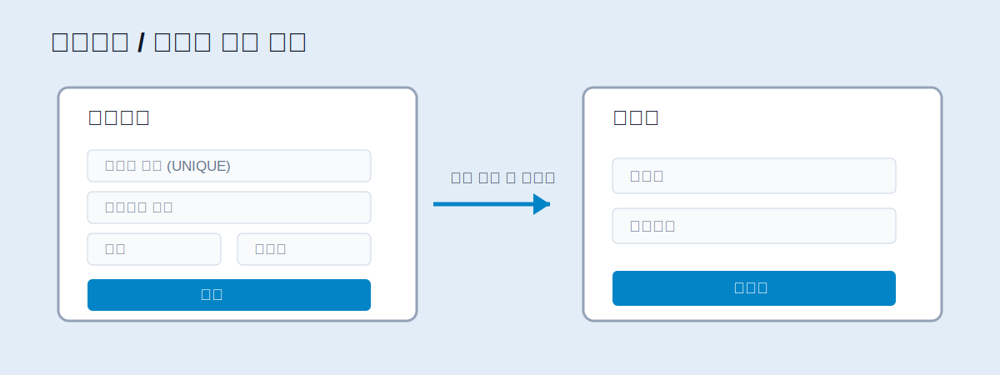
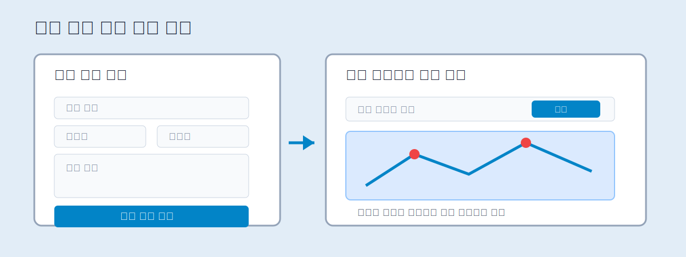
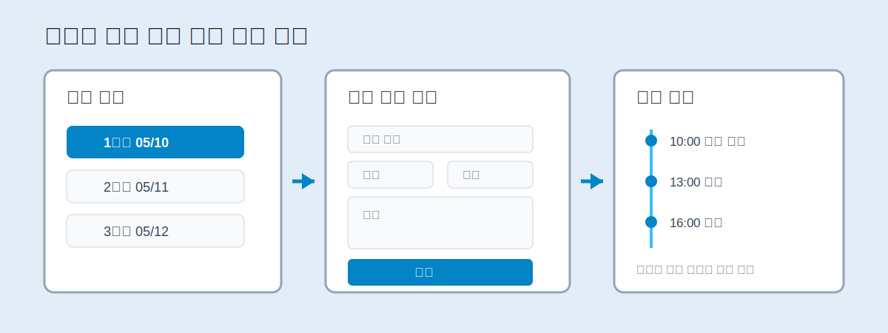

# 1. 요구 사항 분석 및 설계

## 여행 일정 공유 웹 서비스

Trip Planner Web

---

# 목차

1. 요구사항
2. 기능적 요구사항 분석 및 정리
3. 비기능적 요구사항 정리
4. 시스템 설계
5. MVC 디자인 패턴 기반 구조
6. 데이터베이스 설계 요소
7. 화면 설계

---

# 1. 요구사항

## 요구사항 개요

- 본 프로젝트는 여러 사용자가 함께 여행 일정을 계획하고 공유할 수 있는 웹 서비스이다.
- 사용자는 회원가입과 로그인을 통해 서비스를 이용한다.
- 여행 계획을 생성한 뒤 날짜별 세부 일정을 등록할 수 있다.
- 참여자 초대와 공유 링크를 통해 공동으로 여행 일정을 관리할 수 있다.

---

# 2. 기능적 요구사항 분석 및 정리

## 사용자 관리

| ID | 기능명   | 상세 내용                                                                 |
|----| ---------- | --------------------------------------------------------------------------- |
|FR-01| 회원가입 | 사용자는 아이디, 비밀번호, 이름, 이메일을 입력하여 계정을 생성할 수 있다. |
|FR-02| 로그인   | 가입된 사용자는 아이디와 비밀번호로 로그인할 수 있다.                     |
|FR-03| 로그아웃 | 로그인한 사용자는 서비스 이용 후 로그아웃할 수 있다.                      |

---

# 2. 기능적 요구사항 분석 및 정리

## 여행 일정 관리

| ID | 기능명         | 상세 내용                                                                 |
| ---- | ---------------- | --------------------------------------------------------------------------- |
|FR-04| 여행 일정 생성 | 여행 제목, 여행 기간, 여행 지역, 설명을 입력하여 일정을 생성할 수 있다.   |
|FR-05| 여행 일정 조회 | 사용자는 자신이 생성했거나 참여 중인 여행 일정을 목록으로 확인할 수 있다. |
|FR-06| 여행 일정 수정 | 여행 일정 작성자는 등록된 여행 정보를 수정할 수 있다.                     |
|FR-07| 여행 일정 삭제 | 여행 일정 작성자는 불필요한 여행 일정을 삭제할 수 있다.                   |

---

# 2. 기능적 요구사항 분석 및 정리

## 날짜별 세부 일정 관리

| ID | 기능명         | 상세 내용                                                           |
| ---- | ---------------- | --------------------------------------------------------------------- |
|FR-08| 세부 일정 등록 | 여행 날짜별로 방문 장소, 시간, 메모, 예상 비용 등을 등록할 수 있다. |
|FR-09| 세부 일정 조회 | 특정 여행 일정의 날짜별 세부 계획을 확인할 수 있다.                 |
|FR-10| 세부 일정 수정 | 등록된 방문 장소, 시간, 메모, 비용 정보를 수정할 수 있다.           |
|FR-11| 세부 일정 삭제 | 불필요한 세부 일정을 삭제할 수 있다.                                |

---

# 2. 기능적 요구사항 분석 및 정리

## 지도 및 공유 기능

| ID | 기능명         | 상세 내용                                                          |
| ---- | ---------------- | -------------------------------------------------------------------- |
|FR-12| 위치 표시      | Kakao Map API를 활용하여 여행 장소의 위치를 지도에 표시할 수 있다. |
|FR-13| 공유 링크 생성 | 여행 일정별 공유 링크를 생성하여 외부 사용자에게 전달할 수 있다.   |
|FR-14| 참여자 초대    | 여행 일정 작성자는 다른 사용자를 참여자로 초대할 수 있다.          |
|FR-15| 공동 편집      | 권한이 있는 참여자는 여행 일정과 세부 일정을 함께 관리할 수 있다.  |

---

# 3. 비기능적 요구사항 정리

| ID | 구분   | 요구사항                                                                     |
| ---- | -------- | ------------------------------------------------------------------------------ |
|NFR-01| 사용성 | Bootstrap을 활용하여 사용자가 쉽게 이해할 수 있는 화면을 구성한다.           |
|NFR-02| 접근성 | 주요 기능은 메뉴와 버튼을 통해 직관적으로 접근할 수 있도록 설계한다.         |
|NFR-03| 성능   | 일정 목록, 상세 일정, 참여자 정보 조회 시 불필요한 데이터 조회를 최소화한다. |
|NFR-04| 보안   | 로그인한 사용자만 여행 일정 생성, 수정, 삭제 기능을 사용할 수 있도록 한다.   |

---

# 3. 비기능적 요구사항 정리

| ID | 구분          | 요구사항                                                                     |
| ---- | --------------- | ------------------------------------------------------------------------------ |
|NFR-05| 데이터 무결성 | 사용자, 여행 일정, 세부 일정, 참여자 데이터는 외래키를 통해 관계를 유지한다. |
|NFR-06| 유지보수성    | JSP / Servlet / DAO / DTO 구조를 분리하여 MVC(Model2) 패턴에 맞게 구현한다.  |
|NFR-07| 호환성        | Apache Tomcat 환경에서 실행 가능하도록 JSP / Servlet 기반으로 구현한다.      |

---

# 4. 시스템 설계

## 설계 방향

- JSP / Servlet / JDBC 기반 MVC(Model2) 구조를 적용한다.
- 화면 출력, 요청 처리, 데이터 처리를 역할별로 분리한다.
- MySQL 데이터베이스를 활용하여 사용자와 여행 일정 데이터를 저장한다.
- Kakao Map API를 활용하여 여행 장소의 위치를 지도에 표시한다.

---

# 5. MVC 디자인 패턴 기반 구조

| 계층       | 구성 요소 | 역할                                                           |
| ------------ | ----------- | ---------------------------------------------------------------- |
| Model      | DTO       | 사용자, 여행 일정, 세부 일정, 참여자 데이터를 객체로 저장한다. |
| Model      | DAO       | MySQL 데이터베이스와 연동하여 CRUD 기능을 수행한다.            |
| View       | JSP       | 사용자 화면, 입력 폼, 목록, 상세 페이지를 출력한다.            |
| Controller | Servlet   | 사용자 요청을 처리하고 Model 호출 후 JSP로 이동한다.           |
| Database   | MySQL     | 사용자 정보, 여행 일정, 세부 일정, 참여자 정보를 저장한다.     |

---

# 5. MVC 처리 흐름

## 회원가입 및 로그인

1. 사용자가 회원가입 또는 로그인 화면에서 정보를 입력한다.
2. JSP에서 입력된 데이터가 Servlet으로 전달된다.
3. Servlet은 DAO를 호출하여 사용자 정보를 저장하거나 로그인 정보를 확인한다.
4. 로그인 성공 시 세션에 사용자 정보를 저장하고 메인 화면으로 이동한다.
5. 로그인 실패 시 오류 메시지를 출력하고 로그인 화면으로 돌아간다.

---

# 5. MVC 처리 흐름

## 여행 일정 생성

1. 로그인한 사용자가 여행 일정 생성 화면으로 이동한다.
2. 여행 제목, 여행 기간, 지역, 설명을 입력한다.
3. Servlet은 입력값을 검증한 뒤 DAO를 통해 데이터베이스에 저장한다.
4. 저장이 완료되면 여행 일정 목록 또는 상세 화면으로 이동한다.

---

# 5. MVC 처리 흐름

## 날짜별 세부 일정 등록

1. 사용자가 특정 여행 일정의 상세 화면에서 날짜별 일정을 등록한다.
2. 방문 장소, 방문 시간, 메모, 예상 비용, 위치 정보를 입력한다.
3. Servlet은 세부 일정 데이터를 DAO로 전달한다.
4. DAO는 세부 일정 테이블에 데이터를 저장한다.
5. 저장 후 여행 상세 화면에서 등록된 일정을 날짜별로 출력한다.

---

# 5. MVC 처리 흐름

## 일정 공유 및 공동 편집

1. 여행 일정 작성자는 공유 링크를 생성하거나 참여자를 초대한다.
2. 참여자는 공유된 여행 일정에 접근하여 내용을 확인한다.
3. 권한이 있는 참여자는 날짜별 세부 일정을 추가, 수정, 삭제할 수 있다.
4. 변경된 일정 정보는 데이터베이스에 저장되고 다른 참여자에게 동일하게 표시된다.

---

# 6. 데이터베이스 설계 요소

## DB 설계 개요

- DB 관련 내용은 field 이름 중심으로 정리한다.
- 사용자, 여행 일정, 날짜별 세부 일정, 참여자 관리에 필요한 테이블을 설계한다.
- 각 테이블은 Primary Key와 Foreign Key를 활용하여 데이터 관계를 유지한다.

---

# 6. 데이터베이스 설계 요소

## users 테이블

| Field      | Type     | 설명                          |
| ------------ | ---------- | ------------------------------- |
| user_id    | INT      | 사용자 고유 번호, Primary Key |
| login_id   | VARCHAR  | 로그인 아이디, UNIQUE         |
| password   | VARCHAR  | 로그인 비밀번호               |
| user_name  | VARCHAR  | 사용자 이름                   |
| email      | VARCHAR  | 사용자 이메일                 |
| created_at | DATETIME | 회원가입 일시                 |

---

# 6. 데이터베이스 설계 요소

## trips 테이블

| Field       | Type    | 설명                             |
| ------------- | --------- | ---------------------------------- |
| trip_id     | INT     | 여행 일정 고유 번호, Primary Key |
| user_id     | INT     | 여행 일정 작성자 ID, Foreign Key |
| trip_title  | VARCHAR | 여행 일정 제목                   |
| destination | VARCHAR | 여행 지역 또는 목적지            |
| start_date  | DATE    | 여행 시작일                      |
| end_date    | DATE    | 여행 종료일                      |
| description | TEXT    | 여행 설명                        |
| share_code  | VARCHAR | 공유 링크 식별 코드              |

---

# 6. 데이터베이스 설계 요소

## trip_details 테이블

| Field         | Type    | 설명                             |
| --------------- | --------- | ---------------------------------- |
| detail_id     | INT     | 세부 일정 고유 번호, Primary Key |
| trip_id       | INT     | 여행 일정 ID, Foreign Key        |
| schedule_date | DATE    | 세부 일정 날짜                   |
| place_name    | VARCHAR | 방문 장소명                      |
| visit_time    | TIME    | 방문 예정 시간                   |
| memo          | TEXT    | 세부 일정 메모                   |
| cost          | INT     | 예상 비용                        |
| sort_order    | INT     | 일정 정렬 순서                   |

---

# 6. 데이터베이스 설계 요소

## trip_details 위치 정보

| Field     | Type    | 설명      |
| ----------- | --------- | ----------- |
| latitude  | DECIMAL | 장소 위도 |
| longitude | DECIMAL | 장소 경도 |

## 위치 정보 활용

- Kakao Map API와 연동하여 방문 장소를 지도에 표시한다.
- 장소 검색 및 일정 상세 화면에서 위치 확인 기능을 제공한다.

---

# 6. 데이터베이스 설계 요소

## trip_members 테이블

| Field     | Type     | 설명                          |
| ----------- | ---------- | ------------------------------- |
| member_id | INT      | 참여자 고유 번호, Primary Key |
| trip_id   | INT      | 여행 일정 ID, Foreign Key     |
| user_id   | INT      | 참여 사용자 ID, Foreign Key   |
| role      | VARCHAR  | 참여자 권한                   |
| joined_at | DATETIME | 참여 일시                     |

---

# 7. 화면 설계

## 화면 설계 방향

- Bootstrap을 활용하여 반응형 웹 화면으로 구성한다.
- 사용자가 여행 일정 생성, 조회, 수정 기능을 쉽게 사용할 수 있도록 구성한다.
- 실제 화면 설계 이미지는 drawing tool 또는 수작업으로 작성하여 문서에 추가한다.

---

# 7. 화면 설계

## 주요 화면 목록

| 화면                | 주요 구성 요소                                |
| --------------------- | ----------------------------------------------- |
| 메인 화면           | 서비스 소개, 로그인 버튼, 일정 목록 이동 버튼 |
| 회원가입 화면       | 아이디, 비밀번호, 이름, 이메일 입력 폼        |
| 로그인 화면         | 아이디, 비밀번호 입력 폼                      |
| 여행 일정 목록 화면 | 여행 제목, 기간, 지역, 상세보기 버튼          |

---

# 7. 화면 설계

## 주요 화면 목록

| 화면                | 주요 구성 요소                            |
| --------------------- | ------------------------------------------- |
| 여행 일정 생성 화면 | 제목, 여행 기간, 목적지, 설명 입력 폼     |
| 여행 일정 상세 화면 | 날짜별 일정, 지도, 참여자 목록, 공유 링크 |
| 세부 일정 등록 화면 | 날짜, 장소, 시간, 메모, 비용 입력 폼      |
| 참여자 관리 화면    | 참여자 목록, 초대 입력 폼, 권한 표시      |

---

# 7. 화면 설계

## 메인 화면 설계

---

# 7. 화면 설계

## 여행 일정 목록 화면 설계

---

# 7. 화면 설계

## 여행 일정 상세 화면 설계

---

# 8. 설계 요약

- 본 프로젝트는 여행 일정 공유를 중심으로 사용자 관리, 여행 일정 관리, 날짜별 세부 일정 관리 기능을 제공한다.
- 지도 기반 위치 표시, 공유 링크, 참여자 초대 기능을 통해 공동 여행 계획을 지원한다.
- MVC(Model2) 구조를 적용하여 View, Controller, Model의 역할을 분리한다.
- MySQL 데이터베이스를 통해 사용자와 여행 일정 데이터를 체계적으로 관리한다.

---

# 9. Issue 관리

## 9.1 ID 체계

| 구분            | ID 형식  | 설명                                 |
| ----------------- | ---------- | -------------------------------------- |
| 기능적 요구사항 | `FR-번호` | 사용자가 직접 이용하는 기능 요구사항 |
| 비기능적 요구사항 | `NFR-번호` | 보안, 사용성, 유지보수성 등 품질 요구사항 |
| 테스트 및 문서 | `T-번호` |  테스트, 오류 점검, 최종 문서화 작업 |
| 기능 Issue | `F-번호` | 사용자 기능 구현을 위한 GitHub Issue |
| 비기능 Issue	| `NF-번호`	|환경 설정, 구조 구성 등 비기능 작업을 위한 GitHub Issue|

---

## 9.2 Label 구성

| Label             | 설명                                     |
| ------------------- | ------------------------------------------ |
| `setting`         | Maven, Tomcat, DB 연결 등 환경 설정 작업 |
| `feature`         | 새로운 기능 구현                         |
| `docs`            | 문서 작성 및 수정                        |
| `test`            | 테스트 작업                              |
| `auth`            | 회원가입, 로그인, 로그아웃, 세션         |
| `trip`            | 여행 일정 관리                           |
| `detail`          | 날짜별 세부 일정 관리                    |
| `map`             | Kakao Map API 및 위치 표시               |
| `share`           | 공유 링크, 참여자 초대, 공동 편집        |
| `ui`              | JSP 화면, Bootstrap, 화면 흐름           |
| `db`              | MySQL, JDBC, DAO                         |

---

## 9.3 Issue 구성 (1)

| Issue ID | GitHub 제목                                      | 우선순위 | 담당자         | 관련 요구사항                     |
| ---------- | -------------------------------------------------- | :----------: | ---------------- | ----------------------------------- |
| `NF-01`  | `[NF-01] Maven 웹 프로젝트 기본 구조 생성`       |     높음     | 김용민         |    `NFR-06`, `NFR-07`          |
| `NF-02`  | `[NF-02] MySQL 데이터베이스 및 JDBC 연결 설정`   |     높음     | 김용민         | `NFR-03`, `NFR-05`, `NFR-07`     |
| `NF-03`  | `[NF-03] 공통 레이아웃 및 정적 리소스 구조 구성` |     중간     | 김준섭         | `NFR-01`, `NFR-02`, `NFR-06`, `NFR-07`         |
| `F-01`   | `[F-01] 회원가입 화면 및 기능 구현`              |    높음      | 김용민, 김준섭 | `FR-01`, `NFR-01`, `NFR-04`, `NFR-05`         |
| `F-02`   | `[F-02] 로그인 및 로그아웃 기능 구현`            |     높음     | 김용민         | `FR-02`, `FR-03`, `NFR-04`                   |
| `F-03`   | `[F-03] 여행 일정 목록 및 생성 화면 구현`        |     높음     | 김준섭         | `FR-04`, `FR-05`, `NFR-01`, `NFR-02`       |

---

## 9.3 Issue 구성 (2)

| Issue ID | GitHub 제목                                      | 우선순위 | 담당자         | 관련 요구사항                     |
| ---------- | -------------------------------------------------- | :----------: | ---------------- | ----------------------------------- |
| `F-04`   | `[F-04] 여행 일정 CRUD 기능 구현`                |    높음      | 김용민         | `FR-04`, `FR-05`, `FR-06`, `FR-07`, `NFR-04`, `NFR-05` |
| `F-05`   | `[F-05] 날짜별 세부 일정 화면 및 CRUD 구현`      |     높음     | 김용민, 김준섭 | `FR-08`, `FR-09`, `FR-10`, `FR-11`, `NFR-01`, `NFR-05`        |
| `F-06`   | `[F-06] Kakao Map API 연동 및 위치 정보 저장`    |     중간     | 김용민, 김준섭 | `FR-12`, `NFR-01`, `NFR-05`, `NFR-07`                   |
| `F-07`   | `[F-07] 공유 링크 및 참여자 관리 기능 구현`      |     중간     | 김용민, 김준섭 | `FR-13`, `FR-14`, `FR-15`, `NFR-04`, `NFR-05`  |
| `T-01`   | `[T-01] 통합 테스트 및 최종 문서 정리`           |     높음     | 김용민, 김준섭 | 전체 요구사항                     |
